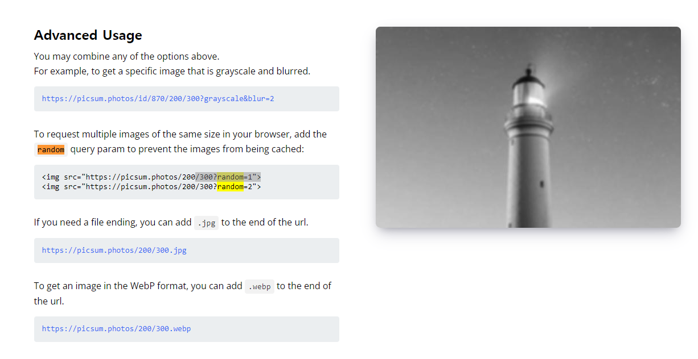

# Random-Photos


## 기능 
랜덤으로 사진을 생성

## 학습
### 1. CSS : 이미지 중앙 정렬
**(1) text-align 속성을 사용**
  
- text-align 속성을 통한 중앙 정렬은 블록 레벨 요소에 대해서만 가능    

  -> 그러므로, 인라인 요소인 img태그를 중앙정렬하기 위해서는 div 와 같은 블록레벨요소로 감싼 후에 div의 text-align 속성에 center를 적용한다. 

  ```
  <div class="image-container">
    
  </div>
  ```
  ```
  div {
    text-align: center;
  }
  ```

**(2) flexbox 사용**   
- 중앙 정렬하고 싶은 요소를 컨테이너 요소로 감싼 후 컨테이너 요소의 display 속성값을 flex로 지정
  ```
  div {
    display: flex;
    justify-content: center; // 수평 중앙 정렬
    align-items : center; // 수직 중앙 정렬  
  }
  ```

**(3) css Grid를 사용**   
- 중앙 정렬하고 싶은 이미지를 감싸는 컨테이너 div 요소를 생성한 후, 컨테이너 div 요소의 display 속성값을 grid로 설정합니다. 
- 그리고 컨테이너 div요소의place-items속성값을 center로 지정하면 이미지가 중앙 정렬
  ```
  div {
    display: grid;
    place-items: center; // 수평 및 수직으로 중앙 정렬
  }
  ```

**(4) margin 속성을 사용** 
- 이미지의 왼쪽과 오른쪽의 margin을 auto로 설정함으로써 이미지를 중앙 정렬
-  margin 속성은 블록 레벨 요소에만 적용됩니다. 따라서 이미지의 display 속성값을 block으로 지정해서 이미지를 블록 레벨 요소로 변환해야 함    
   
    ```
    img {
      display: block; // 인라인레벨 요소를 블록레벨요소로 변환
      margin: 0 auto; // 수평, 수직 중앙 정렬
    }
    ```

### 2. url 조작하기  

브라우저에서 동일한 크기의 여러 이미지를 요청하려면 random 쿼리 매개변수를 추가하여 이미지가 캐시되지 않도록 하세요.


## 학습 출처
**유튜브**   
https://www.youtube.com/@JavaScriptKing    

**이미지 가져오기**   
https://picsum.photos/

**CSS**    
https://www.freecodecamp.org/korean/news/html-center-image-css-align-img-center-example/    

